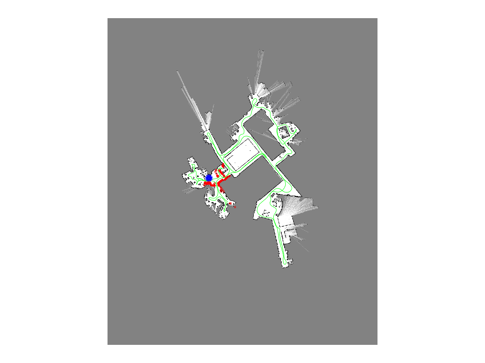

# Occupancy Gridmaps  

This is one (of many) project from the University of Bonn Robot Mapping course taught by Cyrill Stachniss. The project is implementation of Probabilistic Occupancy Gridmaps in 2D with known poses. This implementation include the following:

* beam-endpoint inverse sensor model
* variable gridsizes, down to 0.1 in size

